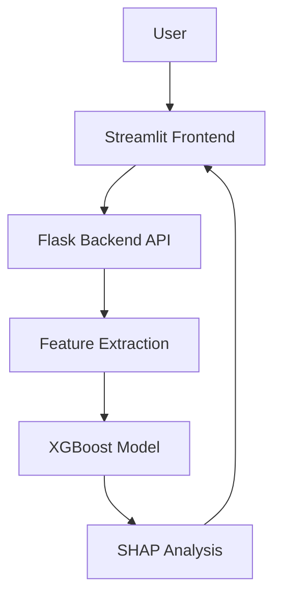

# Diabetes-Check: Architecture & Roadmap

## System Architecture

### Key Components

1. **Frontend (Streamlit)**
   - User authentication
   - Medical report upload
   - Results visualization
   - SHAP plots

2. **Backend (Flask)**
   - REST API
   - JWT authentication
   - OCR processing
   - Model inference

3. **AI Pipeline**
   - Feature extraction
   - XGBoost classifier
   - SHAP interpretability

## Future Roadmap

### Phase 1: Enhanced Data Processing
- [ ] Multi-format support
- [ ] Improved OCR
- [ ] Additional features

### Phase 2: Model Enhancement
- [ ] Real medical datasets
- [ ] Automated retraining
- [ ] Additional risk factors

### Phase 3: Clinical Integration
- [ ] HIPAA compliance
- [ ] EMR integration
- [ ] Doctor dashboard

## Technical Stack

- **Frontend**: Streamlit
- **Backend**: Flask
- **ML**: XGBoost + SHAP
- **OCR**: pytesseract + pdfplumber
- **Deployment**: Docker

## Model Performance

- Accuracy: ~85% (synthetic data)
- Features: 6 clinical markers
- Inference time: < 1s
- Interpretability: SHAP values 